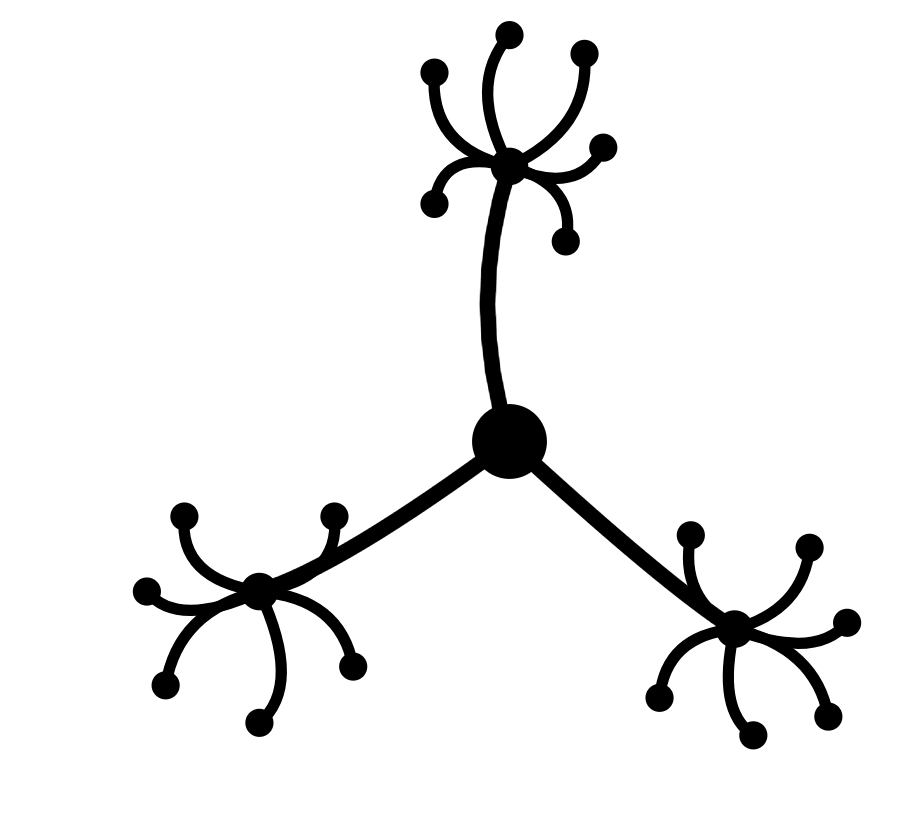

# NERINE - Entity Resolution Pipeline

Resolves person, organization, and other entity mentions across large collections of Norwegian investigative documents. Combines high-recall NER and blocking with ML-based matching and explainable decisions (SHAP), designed for offline deployment in law-enforcement contexts where precision has legal consequences.

<p align="left">
  
</p>

## Pipeline

| Stage | What it does |
|-------|-------------|
| **Ingestion** | Extract text from PDF/DOCX, clean, chunk |
| **Extraction** | NER + normalization + within-doc dedup |
| **Blocking** | FAISS + phonetic + MinHash candidate generation |
| **Matching** | Top-10 feature baseline + LightGBM scoring + SHAP explanations |
| **Resolution** | Connected components + correlation clustering |
| **HITL** | Streamlit UI for human review |

## Tech Stack

| Component | Tool |
|-----------|------|
| NER | `NbAiLab/nb-bert-base-ner` |
| Embeddings | `NbAiLab/nb-sbert-base` |
| Blocking | FAISS, Double Metaphone, MinHash LSH |
| Matching | LightGBM + SHAP (top-10 feature baseline first) |
| Clustering | NetworkX, OR-Tools (CP-SAT / PIVOT) |
| Storage | Parquet + DuckDB |
| UI | Streamlit |
| Tuning | Optuna |


## Project Structure

```
src/
  ingestion/       extraction/      blocking/
  matching/        resolution/      hitl/
  evaluation/      synthetic/       shared/
  pipeline.py
tests/
data/
models/
documents/
```

Each stage has a `run.py` orchestrator. `pipeline.py` calls them in order.
