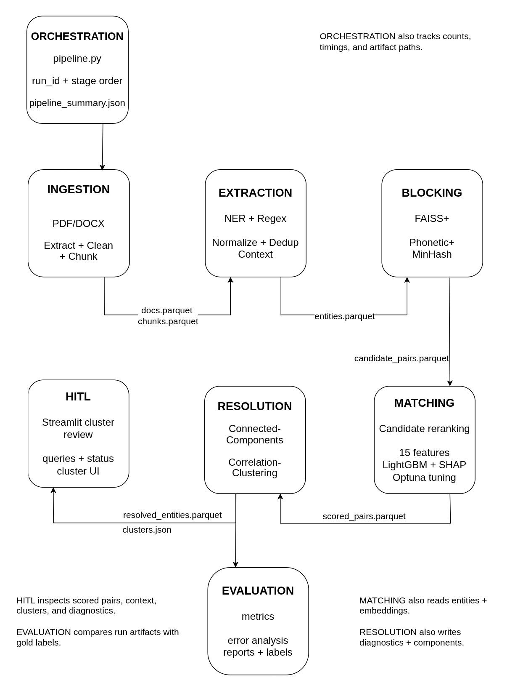

# NERINE - Entity Resolution in Norwegian criminal investigations

Resolves person, organization, and other entity mentions across large collections of Norwegian investigative documents. Combines high-recall NER and blocking with ML-based matching, designed for offline deployment in law-enforcement contexts where explainability and cautious resolution matter.

<p align="left">
  
</p>

## Problem

Investigative document collections can be large, with up to 5 000 documents per case and documents ranging from 1 to 50 pages. The same entity (person, organization, location, vehicle, or account) may appear under many surface forms across PDFs and Word files, making manual linking slow and error-prone. An example is `DNB ASA`, `DNB`, and `Den Norske Bank` - all referring to the same entity. Getting a brief overview of the situation and all entities can be difficult. 

## Research question

How should an Entity Resolution pipeline for large Norwegian text corpora be designed as part of a larger knowledge graph system for criminal investigation - in order to maximize precision and recall while also providing high practical utility, low need for human intervention, fast inference, and good maintainability?


## Solution

NERINE uses a modular multi-stage Entity Resolution pipeline designed around a simple tradeoff: early stages optimize for recall, later stages optimize for precision.

- `Ingestion`: extracts text from PDF/DOCX files, cleans it, and splits it into chunks
- `Extraction`: detects entity mentions using domain-adapted NER, regex rules, normalization, deduplication, and context windows
- `Blocking`: generates high-recall candidate pairs with semantic search, phonetic matching, and MinHash overlap on character n-grams and word tokens
- `Matching / reranking`: scores candidate pairs with engineered similarity features, LightGBM, and SHAP explanations
- `Resolution`: builds consistent entity clusters with connected components and Pivot-based correlation clustering
- `HITL`: exposes uncertain pairs and clusters for targeted human review in Streamlit

This separation is important because missed entities and missed candidate pairs are usually unrecoverable later in the pipeline. Extraction and blocking therefore cast a wide net, while the matching stage is tuned more conservatively because false merges can have serious consequences in an investigative setting.

NERINE performs local entity-resolution cleanup before global matching. Ingestion removes repeated documents using stable document identifiers, extraction deduplicates repeated mentions within a document, and blocking adds exact-match candidate pairs for normalized names and structured identifiers. Blocking does not itself decide final duplicates; it proposes candidate links that matching and resolution later accept or reject.

The matching stage turns heterogeneous signals into fast, explainable pairwise scores. Features can capture lexical similarity, semantic similarity, phonetic similarity, type agreement, and contextual evidence. LightGBM is a good fit here because it handles mixed feature types well, supports fast inference, and works with SHAP for feature-level explanations.

The resolution stage then uses these pairwise scores to build globally consistent clusters. Connected components first partitions the thresholded match graph efficiently, but by itself it can merge too aggressively when one bad edge connects two otherwise separate groups. Pivot-based correlation clustering refines ambiguous components by considering the broader pattern of positive and negative links, making it better suited for conflicting evidence.

This combination gives a practical and maintainable architecture: each stage can be improved independently, the LightGBM matcher and decision thresholds can be tuned with Optuna, intermediate outputs can be inspected between stages, and only the most uncertain cases need manual review.

## Project Status

NERINE is a bachelor thesis prototype under active development. The pipeline runs end to end on reviewed evaluation cases, and current work focuses on case-fold evaluation, tuning and reporting.

The system is not presented as operationally validated. Current evaluation results should be treated as directional until tested on broader and more varied reviewed data.


## Architecture

<p align="left">
  
</p>


## Tech Stack

| Component | Tool |
|-----------|------|
| Text extraction | PyMuPDF, `python-docx` |
| NER | `NbAiLab/nb-bert-base-ner` |
| Embeddings | `NbAiLab/nb-sbert-base` |
| Blocking | FAISS, Double Metaphone, MinHash LSH |
| Matching / reranking | LightGBM, SHAP |
| Resolution | NetworkX, connected components, correlation clustering |
| Storage format | Parquet |
| Query engine | DuckDB |
| DataFrame processing | Polars |
| HITL UI | Streamlit |
| Tuning | Optuna |


## Project Structure

The codebase is organized as a stage-based pipeline. Each pipeline stage has a small
`run.py` orchestrator and focused modules for the actual logic, which keeps the system modular,
easy to test, tune, and replace stage by stage.

```
src/
  ingestion/       PDF/DOCX extraction, cleaning, chunking
  extraction/      NER, normalization, deduplication, context windows
  blocking/        Candidate generation with semantic, phonetic, and token overlap signals
  matching/        Feature extraction, pair scoring, SHAP explanations, tuning
  resolution/      Connected components and correlation clustering
  hitl/            Streamlit tools for human review
  evaluation/      Metrics, error analysis, and quality checks
  synthetic/       Synthetic data generation for early testing
  shared/          Schemas, validation, config, and common utilities
  pipeline.py      End-to-end orchestration
tests/
data/
models/
documentation/     Evaluation, HITL, annotation, and run guides
```

## Evaluation

The repository includes tooling for held-out case evaluation against reviewed gold annotations. The current evaluation setup tests complete cases as held-out folds instead of only reporting training or synthetic metrics.

In the current four-fold reviewed-case tuning run, the best Optuna trial used 120 completed trials and reached macro held-out pairwise F0.5 of `0.955` across four held-out cases, with macro pairwise precision about `0.980` and recall about `0.874`. These numbers are promising for the current reviewed cases and evidence that the workflow functions end to end, but should be treated as directional because the reviewed dataset is still small.

A further evaluation on restricted partner-held material is planned in near future. That data cannot be included in this repository.

## Documentation

More detailed project notes and run guides are available in `documentation/`:

- `README-evaluation.md` for evaluation, case-fold runs, Optuna tuning, and metric interpretation
- `case-fold-runner-real-cases.md` for local case-fold runner usage and reviewed-case notes
- `README-annotation-tooling.md` for annotation workflow. 

## Engineering Scope

This repository demonstrates a full document-to-cluster ML pipeline: ingestion, extraction, candidate generation, supervised matching, graph-based resolution, human review, and evaluation. The focus is on reproducibility, inspectability, and cautious merging in sensitive-data workflows.